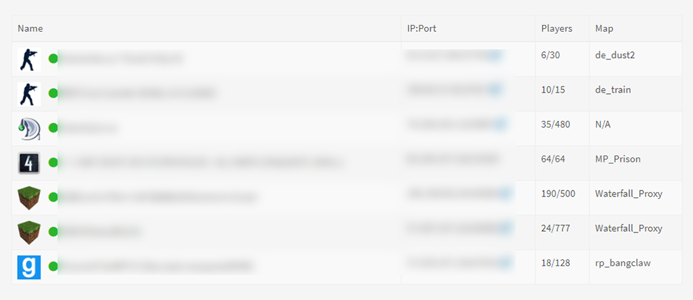

# Server Status

Game/Service server status.

**Supported servers**

https://github.com/Austinb/GameQ/wiki/Supported-servers-list-v3

Run `composer install` before use.

## Requirements

- PHP >= 7.3
- PHP bz2 extension

