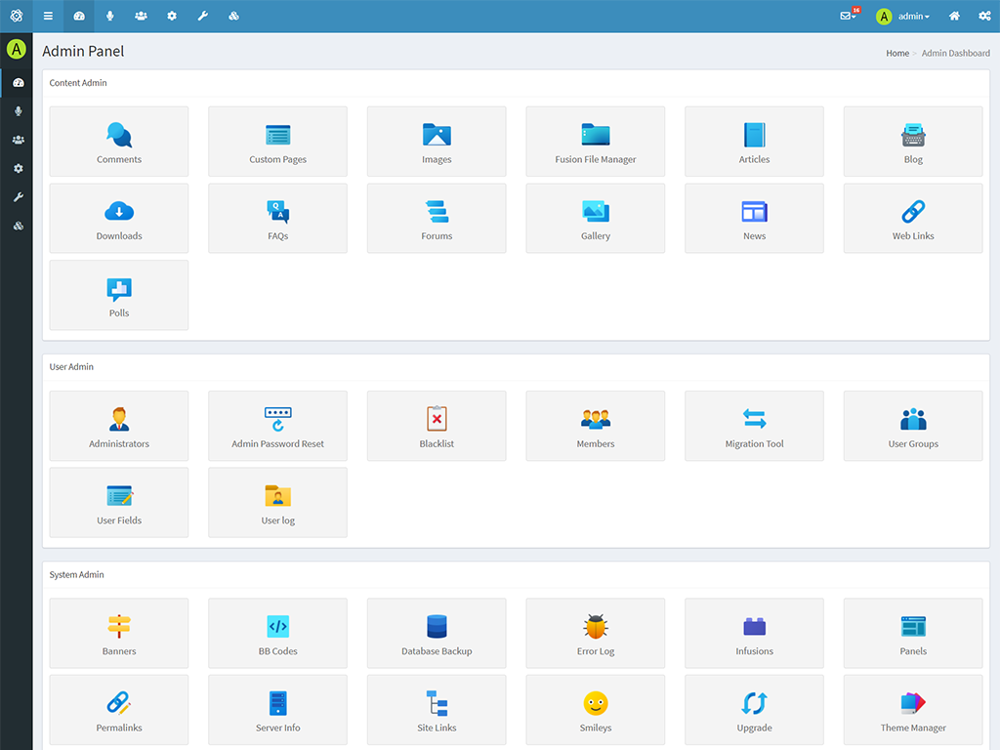

# CP Icon sets

An infusion that allows you to set your own set of icons in the administration. Contains icons for core and my addons.

Flat icons by [Flaticon](https://flaticon.com/).

Fluency icons by [Icons8](https://icons8.com/).

