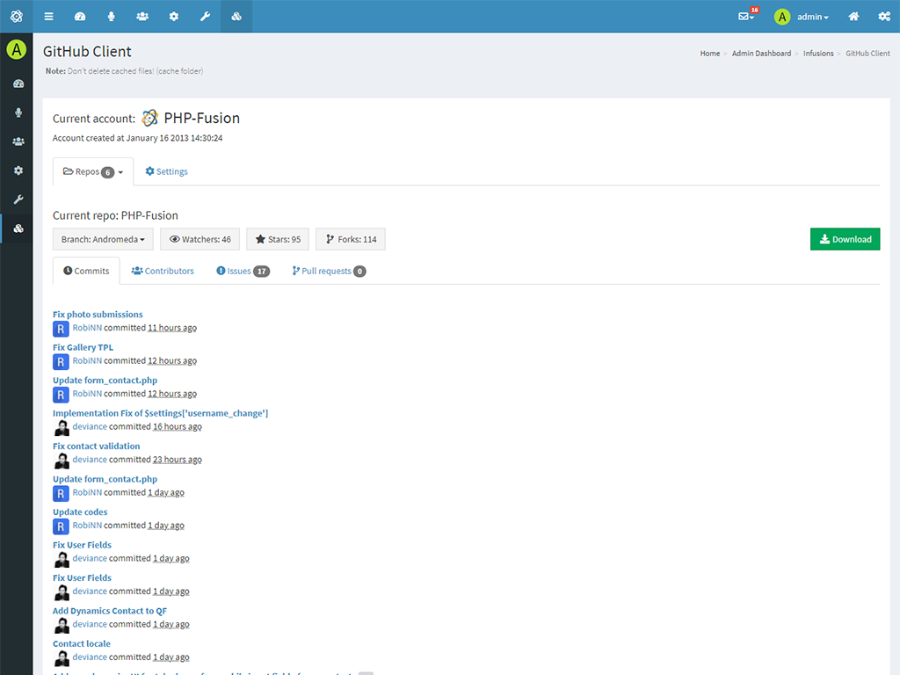

# GitHub Client

GitHub client that allows you to view a basic overview of the project, create a Issues, check Pull Requests... right in your PHPFusion administration.

**Requirements**

- PHP +7.2.5

Run `composer install` before use.

